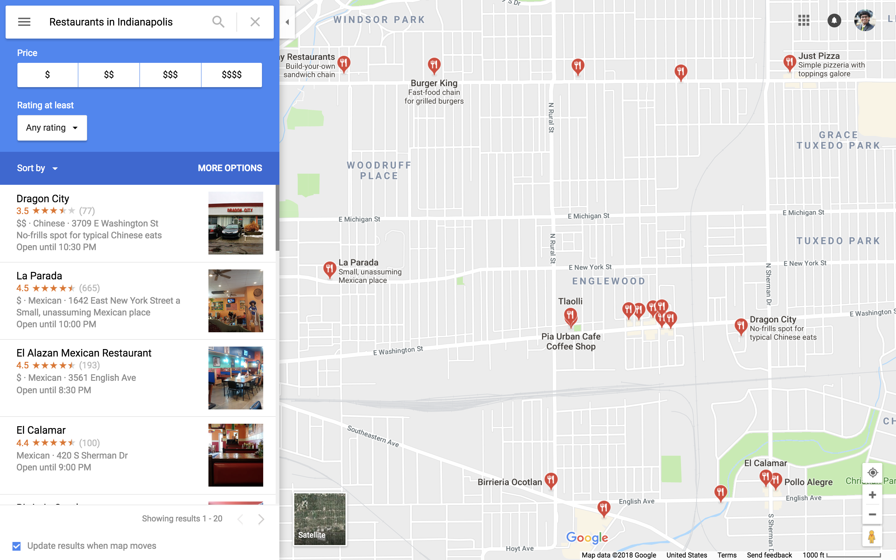
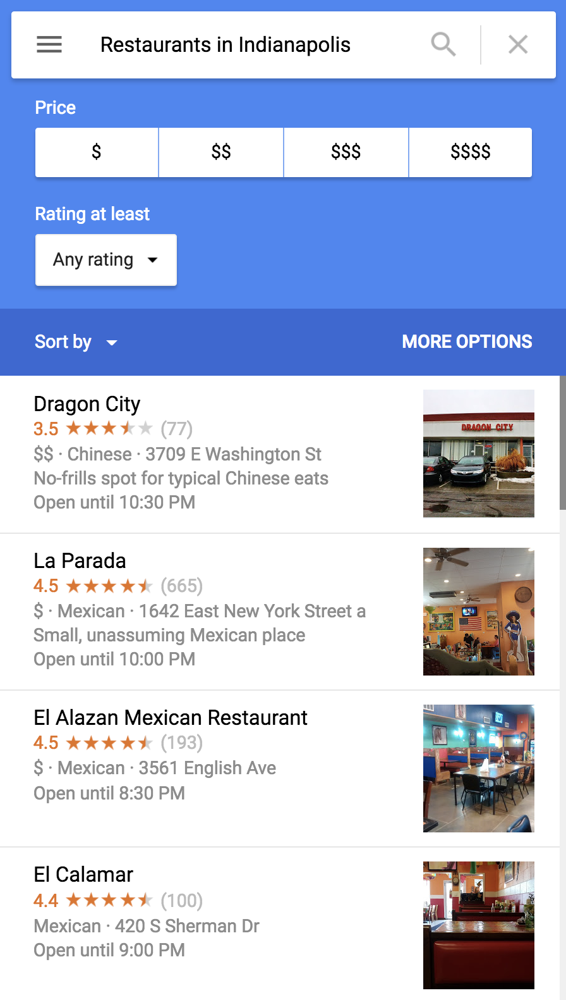

# Programming Project: Variables, Data Types, Operations

## Summary

Decide how to represent real world information in your programs using data types.

## Learning Objectives

Students will:

- (Remember) Recall values that belong to simple data types.
- (Remember) Name variables based on the information they represent.
- (Understand) Give examples of real world information that can be represented with a simple data type.
- (Evaluate) Judge recommendations about how to represent information in a program.

## Task Description

Programming is a skill that can help solve real problems. Successful programmers can think about data in two worlds:

- **Problem Domain:** Information about the real world or a real problem.
- **Solution Domain:** Representations of the real world, for example: our programs.

In this activity, you will explore some examples of how technologists choose to represent data and make your own decisions about data types.

### Part A: Brainstorm

Visualizations in programs like Google Maps can display data in any format, but underneath the view, the data is represented by some data type.

**Question 1:** What information do you see in this restaurant map screenshot that could be represented in a program using simple data types?

Brainstorm at least ten examples, including one of each of the following data types: integer, float, string, boolean. For each example, identify the information, describe how you would represent it using the data type, and suggest a good variable name.

### Part B: Recommend

You are part of a team designing a restaurant search feature similar to the one in this picture. Your team wants to show information about the portion sizes at each restaurant, but is not sure what data type would best represent that information.

**Question 2:** What data type would you choose for storing information about the portion sizes at a restaurant? Why?

- Integer
- Float
- String
- Boolean

**Question 3:** Two of your teammates offer suggestions about how to represent portion sizes. Which suggestion do you like better? Why?

Your teammate Ricardo makes this suggestion:

> "We could use an integer from 1 to 4 to indicate how big the average portion sizes are at the restaurant. For small portions, it would be 1, for huge portions, it would be 4."

Your teammate Angela makes this suggestion:

> "We could have a boolean value. If it's true, it means the restaurant generally has large portions, if it's false, it means the restaurant generally has small portions."
