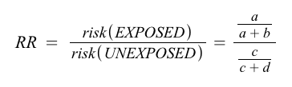

# Programming Project: Input and Output

## Summary

Stress-test a program that makes important calculations to find out where it can go wrong.

## Prerequisites

You should already be familiar with these programming concepts: data types and operations.

## Learning Objectives

Students will:

- (Remember) Locate code responsible for input and output.
- (Understand) Interpret scientific programs.
- (Analyze) Detect bugs in a software program.
- (Analyze) Point out potential causes of bugs.

## Task Description

_**Disclaimer:** This is a work of fiction. Names, characters, businesses, places, events and incidents are either the products of the author’s imagination or used in a fictitious manner. Any resemblance to actual persons, living or dead, or actual events is purely coincidental._

The owner of a popular local restaurant, has received multiple complaints of sickness from customers who ate lunch at their establishment a few days ago. They have asked epidemiologists from the department of public health to help identify any potential causes of illness.

**Epidemiologists** are public health professionals who use data to investigate and reduce the occurrence of disease in humans.

### Program Instructions

In this activity, you will test a computer program that calculates an important statistic for investigating outbreaks: relative risk. More details about relative risk are explained below.

To run the program, run the following commands in your terminal:

```bash
$ python3.6 risk.py
```

The program will then prompt you for input.

### Bug Reports

Your job is to evaluate the program by finding as many bugs as you can.

A **bug** is an error or flaw in a program that leads to unexpected or dangerous behavior. 

There are many ways to write bug reports. In this project, your bug reports should contain the following information:

- Inputs: What data did you give the program?
- Expected Output: What did you expect the program to do?
- Actual Output: What did the program actually do?
- Hypothesis: What do you think caused the program to behave this way?

Provide enough details that someone else could reproduce the bug.

### Data Table

You can use this sample data to test the relative risk program. Create your own examples as well!

**Table 1.** Observations from healthy and sick restaurant customers.

- `a` = number of people who were exposed and became sick
- `b` = number of people who were exposed and did not become sick
- `c` = number of people who were not exposed and became sick
- `d` = number of people who were not exposed and did not become sick

Food | a | b | c | d
---|---|---|---|---
Guacamole | 1 | 0 | 8 | 12
Pinto Beans | 9 | 9 | 0 | 3
Pork | 7 | 2 | 2 | 10
Salsa | 5 | 4 | 4 | 8
Onions | 5 | 1 | 4 | 11
Corn | 1 | 2 | 8 | 10
Chicken | 7 | 11 | 2 | 1
Black Beans | 0 | 5 | 9 | 7
Peppers | 1 | 11 | 8 | 1

### Relative Risk

**Relative Risk** compares the risk of getting sick between two groups: those who were exposed to something and those who were not exposed.

The formula for relative risk is:



When investigating possible foodborne outbreaks, epidemiologists use relative risk to prioritize which food items to investigate further.

If the relative risk is greater than 1, the item is associated with an increased risk of getting sick.

If the relative risk is less than 1, the item is associated with a reduction in risk of getting sick.

Another way to read relative risk is like this: If relative risk of a food item is 3.0, that means someone who eats that item is three times more likely to get sick than someone who did not eat the item.

**Note:** Interpreting relative risk on its own may not be useful. Consider this example:

```
food = chocolate
a = 1
b = 0
c = 1
d = 99
RR = (1 / 1) / (1 / 100) = 100
```

The relative risk is 100! However, this not enough to say that chocolate is the cause of an illness, since only one person ate the chocolate at all.

In practice, relative risk is used alongside other measures and investigative practices to track down the source of an outbreak.